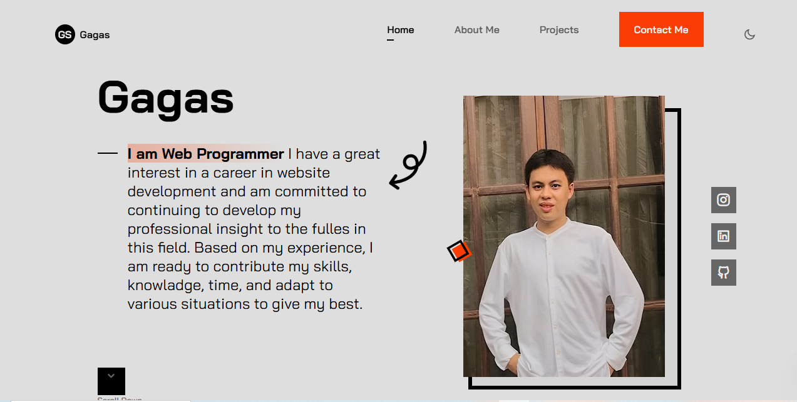
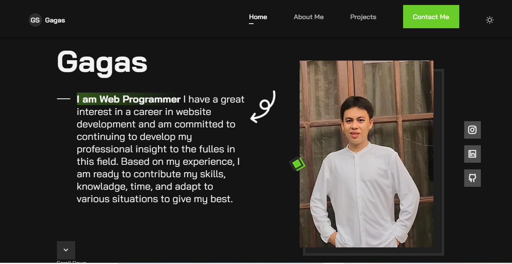
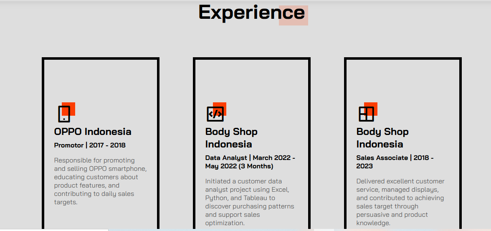
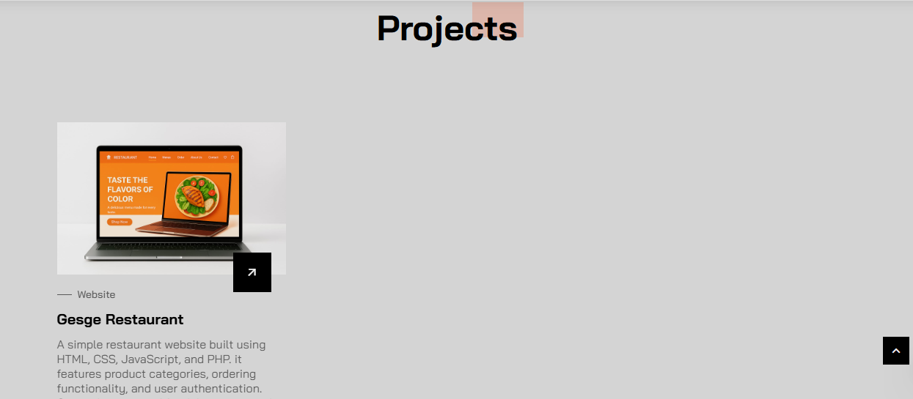
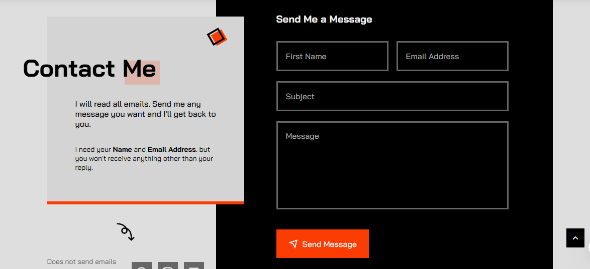
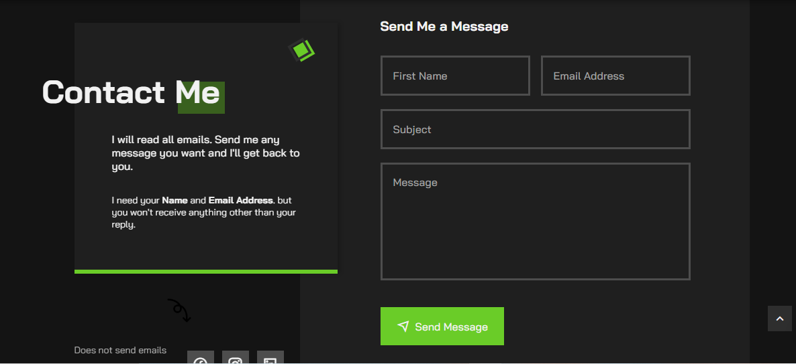

# 🙎‍♂️ gagas-portfolio
This is my personal portfolio, my name is Gagas. I'm passionate about techology, currently focusing on building real-world projects and continuously improving skills through self-learning and exploration.

## 📌 Features
- Homepage with the choose theme color
- About section
- Project section
- Contact section

## 🛠 Built With
- **HTML5**
- **CSS3**
- **JavaScript**
- **RemixIcon**
- **Formspree** (for sand email)

## 💻 Live Preview

## 🖼 Screenshot

### Homepage Light

### Homepage Dark

### Experience

### Projects

### Contact Light

### Contact Dark

## 🚀 Installation
To run this portfolio locally.

1️⃣ Clone the repository
git clone https://github.com/Gagasgees/gagas-portfolio.git

2️⃣ Navigate to the project directory
cd gagas-portfolio

3️⃣ Open the project with your browser
if you are using a local server (e.g. Live Server extension in VSCode). Start Live Server or simply open index.html in your browser

⚠ This portfolio is built using only HTML, CSS and JavaScript. So no additional installations or dependencies are required. 

## 🤝 Contribute
This portfolio project is curently not accepting external contributions. However, feedback and suggestions are always welcome!. Feel free to open an issue if you find any bugs or want to suggest improvements.

## 🙎‍♂️ Author
Gagas
Aspiring programmer passionate about web development and data analyst.

## 💌 Contact Me
**Email :** akugagass@gmail.com
**Github :** https://github.com/gagasgees/
